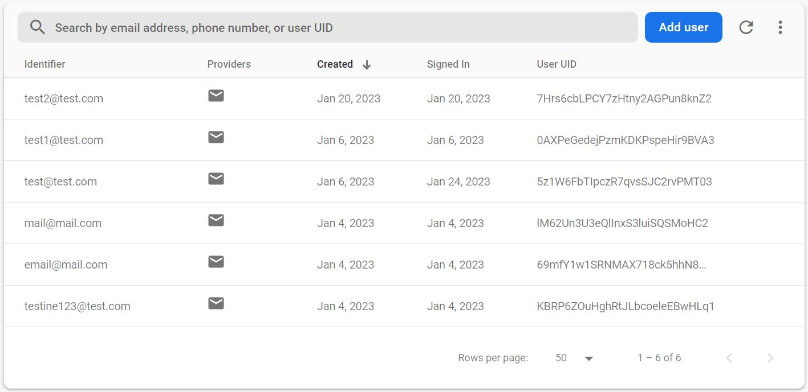
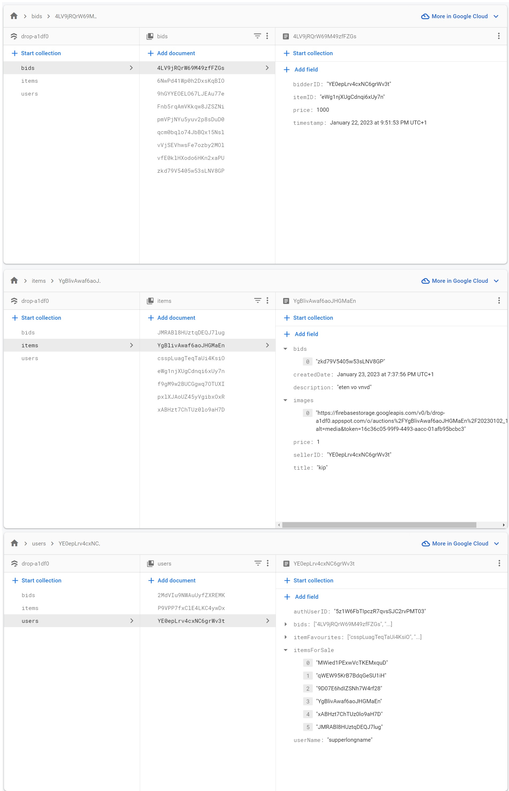
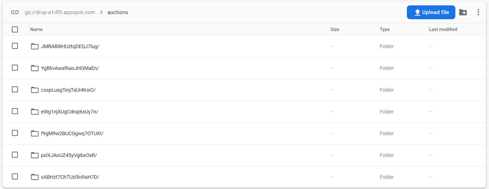

# Project fluttereindwerk - DROP
Flutter project voor mijn examen.
Project voorstel:
   Een 2eHands App.
   Verwijderen van item
   Plaatsen van item
   Bieden op Item
   Zoeken van Item
   Inloggen Account

## Table of Contents
* [General Info](#general-information)
* [Technologies Used](#technologies-used)
* [Features](#features)
* [Screenshots](#screenshots)
* [Usage](#usage)
* [Project Status](#project-status)
* [Dificulties](#Dificulties)

## General Information
Dit is een 2e hands app genaamd DROP waar je items kan op auctioneeren.
Je kan een auction aanmaken, bieden, opslaan in favourites, verwijderen etc...

## Technologies Used
-  Flutter
-  [_Firebase firestore_](https://firebase.google.com/docs/firestore/)
-  [_Firebase authentication_](https://firebase.google.com/docs/auth/flutter/start)
-  [_Firebase cloud storage_](https://firebase.google.com/docs/storage/flutter/start)

## Features
- Creating auction
- Deleting auction
- Searching auction
- Placing bid
- Favouriting
- Editing username

## Screenshots firebase
Authentication

Database

Storage

## Usage
Ik heb problemen ondervonden met een recente android update als je met Android virtual machine werkt, firebase loopt blijkbaar iets achter kwa updates waardoor je verbindingsproblemen kan ondervinden. Dit heb ik niet voorgehad met debugging op mijn personelijke gsm.

## Project Status
Concept is klaar.

## Dificulties
Ik heb veel met streams en streambuilders zitten sukkelen en mezelf wat moeilijk gemaakt. Uiteindelijk had ik al heel wat bijgeleerd voor het
werken met streams en state management, alsook hoe je snel je project om zeep kan helpen. Na heel wat opzoeken en debuggen is het denk ik toch beetje gelukt, ik heb die code nu laten staan.

Alsook heb ik ondervonden dat een no sql database zoals firebase eigenlijk echt geen plezier is oom mee te werken in vergelijking met een sql database.
Het linken van tabellen en id's moest dus manueel gebeuren. Querry's naar de firestore zijn ook niet erg innovatief.